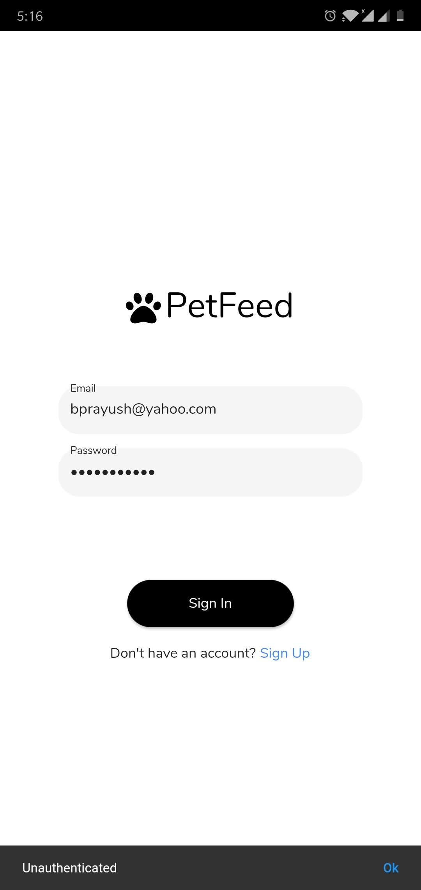
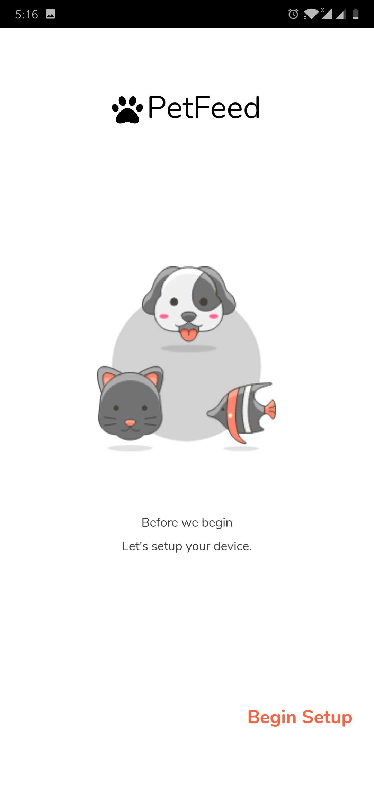
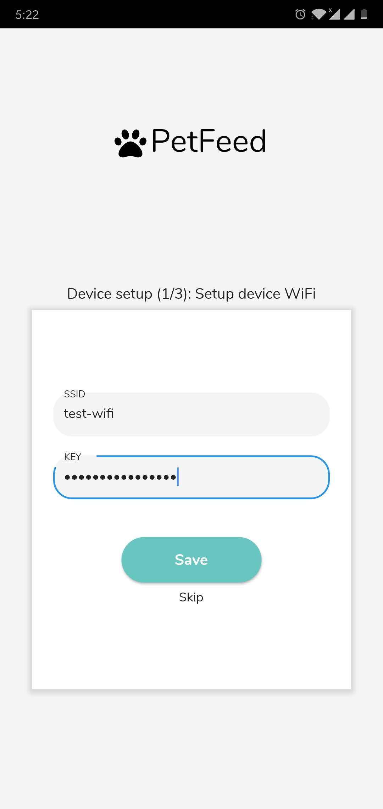
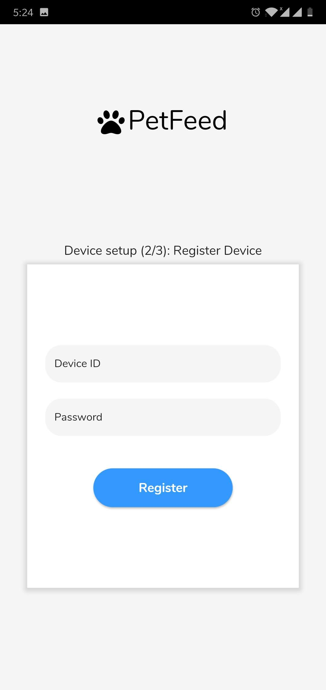
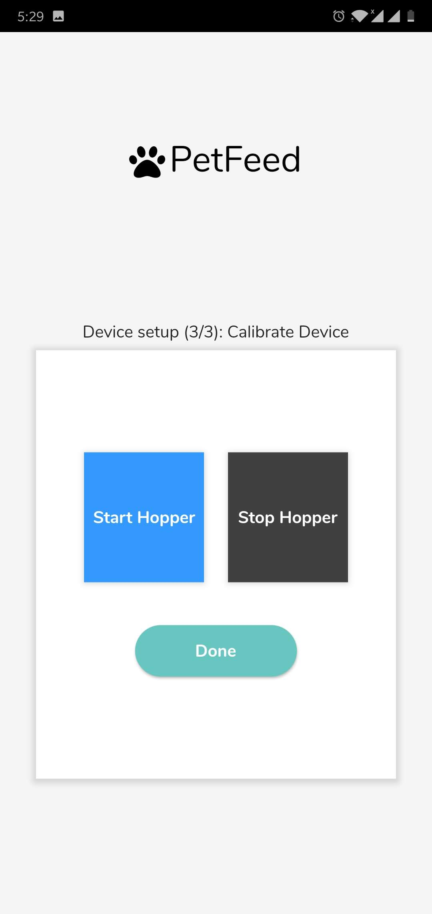
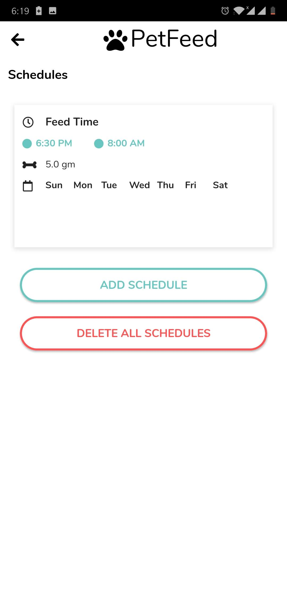
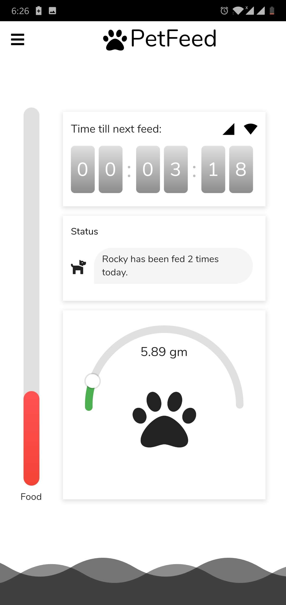

# PetFeed

## Descrpition
A simple project for automating the petfeeding process. Currently the desings works for fish, dogs, cats and birds and only support solid foods.

## Technologies Used
- **Flutter:** For faster android application development.
- **Laravel:** For backup and authentication functionality.
- **Flask:** For offline functionality with Raspberry Pi.
- **Raspberry Pi:** The brains of the device.
- **Pusher:** For socket functionality.

### Screenshots
#### Mobile App

#### Device

